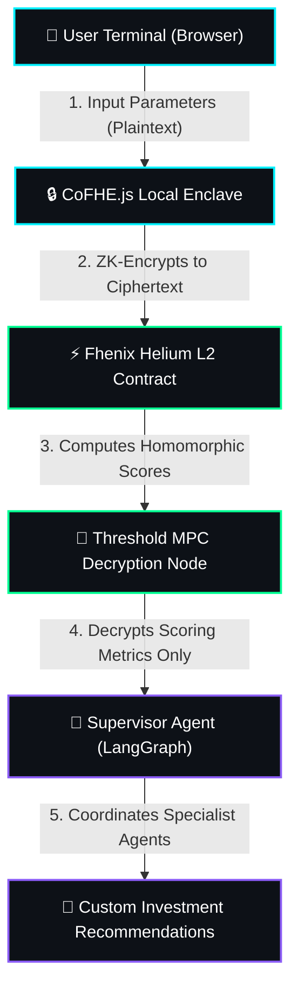

# 🛡️ CipherAlpha AI
> **Confidential DeFi Portfolio Intelligence Core** powered by Fully Homomorphic Encryption (FHE) & Multi-Agent LangGraph Orchestration.

---

[](https://fhenix.zone)
[](https://github.com/fhenixprotocol)
[](https://langchain-ai.github.io/langgraph/)
[](#)

CipherAlpha AI is a privacy-first wealth management and robo-advisory terminal. It allows DeFi investors to obtain advanced portfolio optimization strategies and multi-agent AI analysis **without ever exposing their asset valuation, investment budgets, risk appetites, or target yields** to centralized databases, RPC providers, or LLM host servers.

---

## 💡 The Core Differentiator: Privacy-First AI

Traditional DeFi advisory engines require you to reveal your wallet history, portfolio weights, and investment goals to centralized APIs. This compromises privacy and leaves you vulnerable to MEV bots, frontrunning, and social engineering.

**CipherAlpha changes the paradigm:**
* **Zero-Knowledge Client-Side Encryption:** All personal portfolio inputs are ZK-encrypted locally in the browser using `CoFHE.js` before they touch the network.
* **On-Chain Homomorphic Advisory**: The Fhenix Helium L2 smart contract processes calculations directly on the *ciphertexts* (encrypted inputs) without decrypting them.
* **MPC-Decrypted Signal Output**: Only the resulting high-level analytics scores (e.g., Portfolio Health, Risk Category, Yield APY targets) are decrypted via Threshold Multi-Party Computation (MPC) and passed to the AI agents.
* **Confidential Multi-Agent Reasoning**: LangGraph AI agents analyze the decrypted scoring metrics along with public market data to deliver custom, hyper-optimized strategies without learning your plaintext holdings.

---

## 🛠️ System Architecture



---

## 🚀 Key Features & Use Cases

### 1. Shielded Portfolio Configuration
Enter your sensitive strategy targets—including total valuation, available capital, risk tolerances, and target yields—securely. All fields are locally encrypted into ciphertexts before blockchain submission.

### 2. Multi-Agent AI Terminal (LangGraph)
An autonomous network of 5 specialized AI agents arbitrated by a Supervisor Node:
* 🛡️ **Risk Analyst**: Evaluates concentration risks and potential drawdown exposure.
* 📈 **DeFi Optimizer**: Queries Fhenix Helium liquidity pools, lending markets, and yield pools.
* 🔄 **Portfolio Rebalancer**: Dynamically calculates weight rebalancing paths.
* 👁️ **Token Intelligence**: Analyzes smart contract safety and exploit parameters.
* 📊 **Market Sentiment**: Evaluates social activity, developer metrics, and volume flows.

### 3. High-Fidelity Crypto Terminal UI
A premium dark trading terminal design optimized for dashboard tracking, live price feeds, active order-book depth analysis, and real-time transaction history simulation.

---

## 🧱 The FHE / CoFHE.js Pipeline

Here is the underlying technical flow that handles the secure data lifecycle:

1. **Client-Side Encryption**:
   ```typescript
   // Local browser ZK-encryption using Fhenix public keys
   const encryptedInputs = await FheHelper.encryptMultiple([
     inputs.portfolioValue,
     inputs.investmentBudget,
     inputs.riskPreference
   ], userAccountAddress);
   ```

2. **L2 Smart Contract Processing**:
   ```solidity
   // Fhenix Solidity contract calculates health index homomorphically
   euint32 eHealth = FHE.select(
       eRisk.gt(50),
       eDiversification.mul(2) + eLiquidity,
       eDiversification.mul(3)
   );
   ```

3. **Threshold MPC Decryption**:
   The network validators jointly compute the decryption of the output scores (`riskScore`, `portfolioHealth`) without revealing any of the underlying inputs.

---

## 📂 Repository Structure

```
├── CipherAlpha/
│   ├── backend/                # LangGraph & Supervisor Node API Server
│   │   ├── src/
│   │   │   ├── agents/         # Specialized AI agents (Risk, DeFi, Sentiment, etc.)
│   │   │   ├── services/       # Indexer and blockchain listener services
│   │   │   └── app.ts          # Express API server (Chat & Orchestration endpoints)
│   │   └── .env.example
│   ├── frontend/               # Premium React + Vite + TS UI Dashboard
│   │   ├── src/
│   │   │   ├── components/     # UI Pages (Markets, Trade, ChatWindow, AgentPanel)
│   │   │   ├── hooks/          # useMetaMask simulation & API integration hook
│   │   │   └── index.css       # Core styling & custom animations
│   │   └── index.html
│   └── hardhat.config.ts       # Fhenix smart contract workspace
```

---

## 📂 Getting Started

### Prerequisites
* [Node.js](https://nodejs.org/) (v18+)
* [Git](https://git-scm.com/)
* A [Groq API Key](https://console.groq.com/) (for real-time agent execution)

### 1. Clone & Install
```bash
git clone https://github.com/Krushna968/CipherAlpha.git
cd CipherAlpha
```

### 2. Configure Backend
Navigate to the `backend/` directory:
```bash
cd backend
cp .env.example .env
```
Edit the `.env` file and add your `GROQ_API_KEY`:
```env
PORT=3001
GROQ_API_KEY=gsk_your_actual_groq_key_here
FHENIX_RPC_URL=https://rpc.fhenix.zone
```

### 3. Run the Backend
```bash
npm install
npm run dev
```

### 4. Run the Frontend
Open a new terminal window, navigate to `frontend/`:
```bash
cd frontend
npm install
npm run dev
```
Open [http://localhost:3000](http://localhost:3000) (or the port specified in your console) to launch the CipherAlpha dashboard.

---

## 🔒 Security & Privacy Assertions
* **Zero Plaintext Storage**: Plaintext valuation, allocation, and budget values never touch a remote server database.
* **FHE-Powered Enclaves**: On-chain computations are secured by Fhenix FHE (TFHE-rs) protecting against miner frontrunning.
* **Data Leak Mitigation**: Groq LLM API only receives decrypted score integers (0-100) and general public token balances, leaving the actual holdings confidential.
